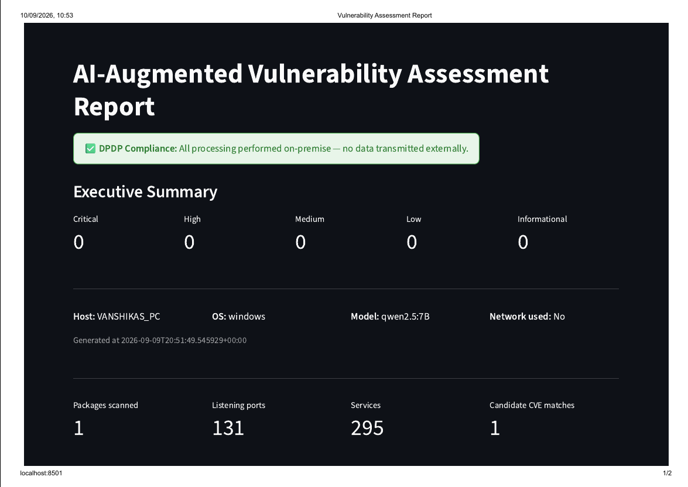
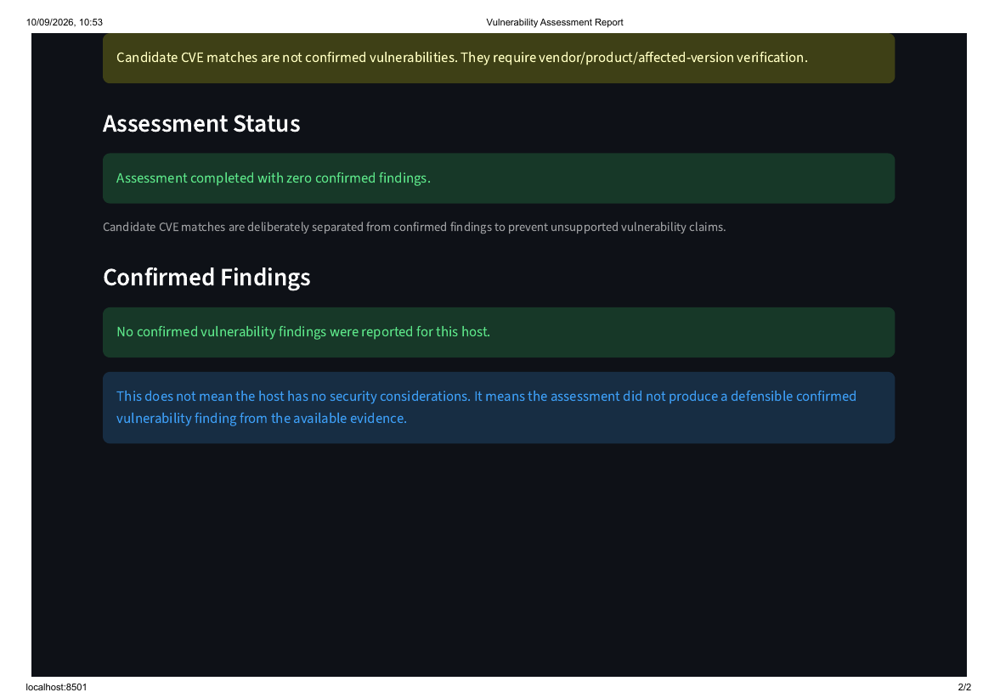

# Research on Open-Source LLMs for AI-Augmented Vulnerability Assessment
 
Internship project at **Jio Platforms Limited**, exploring whether open-source, on-premise Large Language Models can perform reliable vulnerability assessment for Telecom Service Provider (TSP) environments — without sending infrastructure data to third-party cloud APIs (a hard requirement under India's DPDP Act 2023, NCIIPC guidelines, and TRAI telecom security regulations).
 
The project has two parts:
 
1. **A benchmark & evaluation pipeline** — a 100-item, 5-category dataset used to comparatively score six open-source LLMs (DeepSeek-Coder V2 16B, Gemma 2 9B, Llama 3.1 8B, Mistral 7B, Phi-3.5 Mini, Qwen2.5-Coder 7B) on CVE reasoning, config/misconfiguration detection, remediation quality, hallucination rate, and structured-output reliability.
2. **`vuln_tool_prototype/`** — a working end-to-end CLI tool built from the findings: local artifact collection → local CVE enrichment (RAG) → local LLM inference via Ollama → structured, validated JSON report.
Full write-up (methodology, results tables, failure analysis): [`internship_project.pdf`](./internship_project.pdf).
 
## Key result
 
In 30-case validation, the full prototype pipeline (Qwen2.5:7B + mandatory RAG + evidence-grounded prompting) achieved **100% precision, recall, F1, JSON validity, and CVSS-tier accuracy**, compared to 0% for a bare base model and ~45–61% for RAG alone.
 
## Repository structure
 
```
.
├── internship_project.pdf        # Full report: methodology, results, failure analysis
│
├── NVD_api.py                     # NVD CVE API client (fetch, CVSS/description extraction)
├── category1.py / category1_final.csv     # Category 1: known CVEs — dataset build
├── category2.py / category2_final.csv     # Category 2: novel (post-cutoff) CVEs
├── category3.py / category3snippets/      # Category 3: OS config misconfigurations
├── category4.py / category4_manifest/     # Category 4: Kubernetes manifest misconfigurations
├── category5.py / category5_scenarios/    # Category 5: multi-artifact scenarios
├── 1stcatfinal.py, 2ndcatfinal.py         # Selection/dedup logic for categories 1 & 2
├── datasetloader.py               # Loads the full 100-item benchmark dataset
├── prompt_templates.py / prompt_builder.py # Per-category evaluation prompts
├── ragretrival.py                 # Chroma-based retrieval for RAG-augmented runs
├── model-load.py / runprompt.py   # Runs the benchmark across installed Ollama models
├── judge_eval.py                  # LLM-as-judge scoring for non-binary categories
├── score_findings.py              # Keyword-based scoring (fast, approximate pass)
├── score_results.py               # Objective scoring (JSON validity, CVE accuracy, RAG delta)
├── *.csv                          # Intermediate/ground-truth/results data for the above
│
└── vuln_tool_prototype/           # The working prototype tool
    ├── main.py                    # End-to-end CLI: collect → enrich → assess → report
    ├── run_assessment.py          # Assess an existing collection + enrichment through Ollama
    ├── collectors/                # Linux / Windows / container artifact collectors
    ├── cve/                       # Local CVE index, NVD ingest, package lookup, retrieval
    ├── llm/                       # Prompt building + Ollama inference engine
    ├── schema/                    # Pydantic schemas for artifacts & findings
    ├── report/                    # Streamlit report/dashboard generator
    ├── validation_benchmark/      # 30-case base vs. RAG vs. full-prototype validation
    ├── tests/                     # Offline/unit tests
    ├── data/                      # Sample enrichment & assessment output
    └── README.md                  # Prototype-specific architecture & run notes
```
 
## Setup
 
Requires Python 3.10+ and [Ollama](https://ollama.com) installed locally with the models you want to test pulled (e.g. `ollama pull qwen2.5:7b`).
 
```bash
git clone https://github.com/Vanshika-mohiley/jio_internship.git
cd jio_internship
pip install requests ollama chromadb pandas
```
 
For the prototype tool specifically:
 
```bash
cd vuln_tool_prototype
pip install -r requirements.txt
```
 
An NVD API key is optional but recommended (raises the rate limit) — set it as an environment variable:
 
```bash
export NVD_API_KEYS=your_key_here
```
 
## Usage
 
### Run the benchmark evaluation
 
```bash
# Build/refresh the dataset categories (optional — final CSVs are already included)
python category1.py && python 1stcatfinal.py
python category2.py && python 2ndcatfinal.py
 
# Run all installed Ollama models against the full dataset
python model-load.py
 
# Score the results
python score_results.py          # objective metrics (JSON validity, CVE accuracy, RAG delta)
python score_findings.py         # keyword-based pass for config/manifest/multi-artifact
python judge_eval.py --judge-model qwen2.5:7B --results evaluation_results.csv
```
 
### Run the prototype end-to-end
 
```bash
cd vuln_tool_prototype
 
# Start Ollama locally first, and make sure the model is pulled
python main.py --os linux --chroma-dir ./data/chroma --db-path ./data/advisories.db \
    --model llama3 --out report.json
 
# View the report
streamlit run report/report_generator.py -- --report-json report.json
```
 
Or assess an existing artifact collection directly:
 
```bash
python run_assessment.py --collection windows_artifacts.json --enrichment data/enrichment.json --model qwen2.5:7B
```
 
### Reproduce the 30-case validation
 
```bash
cd vuln_tool_prototype
python validation_benchmark/run_validation.py --model qwen2.5:7B
```
 
Compares base-model-only, RAG-only, and full-prototype configurations on the same 30 cases. See `vuln_tool_prototype/validation_benchmark/README.md` for details.

### Prototype Architecture
<p align="center">
  
  
</p>

## Notes
 
- All LLM inference runs against a local Ollama server (`http://localhost:11434`) — no data leaves the network boundary, by design.
- `vuln_tool_prototype/README.md` documents the canonical Day 1–4 architecture and known limitations of the prototype in more detail.
- The exact package-version comparator in the prototype is a best-effort parser, not a substitute for distro-native RPM/dpkg version semantics — see the prototype README for the full caveat.
## Author
 
**Vanshika Mohiley** — Internship at Jio Platforms Limited, under the supervision of Mr. Gaurav Kudaisya.
